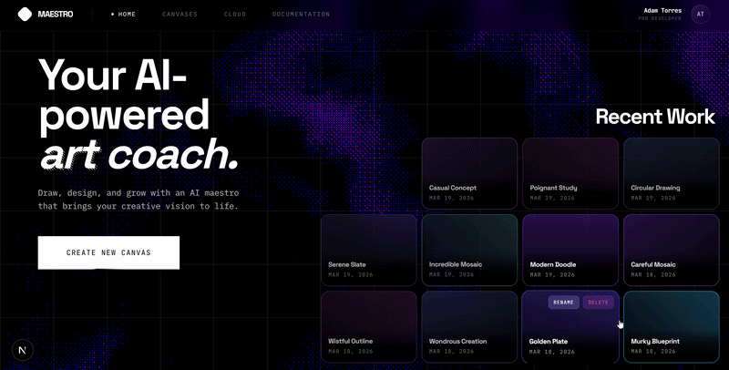

# Maestro

**An AI-powered canvas that draws with you**


---

<p align="center"></p>

<p align="center"></p>

---

## Overview

Maestro is an AI whiteboard where your sketches become finished artwork. Draw a rough shape, pause, and Gemini auto-completes it into a polished image — directly on the canvas. Select a region with the lasso, speak into the mic, or type in the chat sidebar to direct what gets drawn next. Every AI result is previewed first; you accept or reject it before it's committed.

AI is the core of the app — without Gemini image generation the sketch-to-completion loop doesn't exist. Classification, generation, and object detection all run on every request.

Built for the **NittanyAI Challenge**.

---

## Features

| Feature | Description |
|---|---|
| **AI Sketch Completion** | Auto-triggers after a brief pause; Gemini completes your drawing in context |
| **Lasso Selection** | Draw a region → AI fills it in, bounded to your selection |
| **Voice Prompting** | Record via mic → Whisper transcribes → Gemini draws |
| **Chat Sidebar** | Text prompts with intent classification (draw vs. respond) |
| **Layer Management** | Visibility, lock, reorder; AI shapes land on their own layer |
| **Auto-save** | Debounced 2s sync to Supabase |
| **Accept / Reject** | Every AI result is shown as a pending overlay before being committed |

---

## Tech Stack

| Category | Technology |
|---|---|
| Canvas | tldraw |
| Framework | Next.js 15 App Router |
| AI | Gemini (intent classification + image generation) |
| Voice | OpenAI Whisper |
| ML Service | Grounding DINO (object crop, CUDA) |
| Database | Supabase (Postgres) |
| Runtime | Bun |

---

## Architecture & Data Flow

```
Sketch / Voice / Chat
      ↓
useCanvasSolver — captures canvas snapshot
      ↓
POST /api/generate-solution
      ↓
[Optional] ml_service /crop  ←  Grounding DINO (CUDA)
      ↓
Gemini intent classifier  →  Gemini image generation
      ↓
Pending image shown on canvas
      ↓
Accept ✓  →  shape committed + auto-saved to Supabase
Reject ✗  →  shape discarded
```

---

## Prerequisites

- [Bun](https://bun.sh) (or Node.js 18+)
- [Supabase](https://supabase.com) project
- Google AI API key (Gemini)
- OpenAI API key (Whisper)
- *(Optional)* NVIDIA GPU + CUDA 12.4 for the ML service (smart cropping)

---

## Supabase Setup

1. Create a new Supabase project.
2. Run the following SQL in the **SQL Editor**:

```sql
create table whiteboards (
  id uuid primary key default gen_random_uuid(),
  title text not null,
  data jsonb not null default '{}',
  created_at timestamptz default now(),
  updated_at timestamptz default now()
);
```

---

## Installation & Environment

```bash
bun install
```

Create a `.env.local` file in the project root:

```
NEXT_PUBLIC_SUPABASE_URL=
NEXT_PUBLIC_SUPABASE_ANON_KEY=
OPENAI_API_KEY=
GOOGLE_AI_API_KEY=
```

---

## Running the App

```bash
bun run dev
```

Open [http://localhost:3000](http://localhost:3000).

---

## Running the ML Service *(Optional)*

The ML service enables smart object cropping via Grounding DINO before generation. Requires a CUDA-capable GPU.

```bash
cd ml_service
uv run main.py
```

Starts at `http://localhost:8001`. Without it, lasso selections skip cropping and pass the full canvas region directly to Gemini.

---

## Usage

1. **Create a board** from the dashboard
2. **Draw on the canvas** — AI auto-completes after a brief pause
3. **Lasso a region** for targeted generation within a selection
4. **Click the mic** to describe what to draw via voice
5. **Open the chat sidebar** for directed text prompts
6. **Manage layers** in the bottom-right panel (visibility, lock, reorder)
7. **Accept ✓ or Reject ✗** each AI result before it's committed

---

## Project Structure

```
nexhacks/
├── src/
│   ├── app/
│   │   ├── api/
│   │   │   ├── generate-solution/   # Main AI generation endpoint
│   │   │   └── voice/transcribe/    # Whisper proxy
│   │   └── board/[id]/              # Board page
│   ├── features/
│   │   ├── ai/                      # useCanvasSolver, prompts, AI components
│   │   ├── board/                   # Canvas, layers, lasso, toolbar
│   │   └── voice/                   # Mic recording, voice UI
│   └── lib/                         # Supabase client, logger, utilities
└── ml_service/                      # Grounding DINO FastAPI service
```

---

## API Reference

### `POST /api/generate-solution`

Generates an AI image from a canvas snapshot and optional prompt.

**Request** (`multipart/form-data`):

| Field | Type | Description |
|---|---|---|
| `image` | `File` | PNG snapshot of the canvas |
| `prompt` | `string` | Optional text prompt |
| `source` | `string` | `"chat"` triggers intent classification; omit for auto-complete |
| `skipCrop` | `string` | `"true"` skips Grounding DINO cropping (used for lasso) |
| `reference_*` | `File` | Optional reference images (any number) |

**Response**:

```json
{
  "success": true,
  "imageUrl": "data:image/png;base64,...",
  "textContent": "",
  "crop": [x1, y1, x2, y2]
}
```

`crop` is present when Grounding DINO was used. `imageUrl` is `null` when intent classification determined no drawing was needed.

---

### `POST /api/voice/transcribe`

Proxies audio to OpenAI Whisper and returns a transcript.

**Request** (`multipart/form-data`):

| Field | Type | Description |
|---|---|---|
| `audio` | `Blob` | WAV audio recording |

**Response**:

```json
{ "text": "draw a mountain range" }
```
